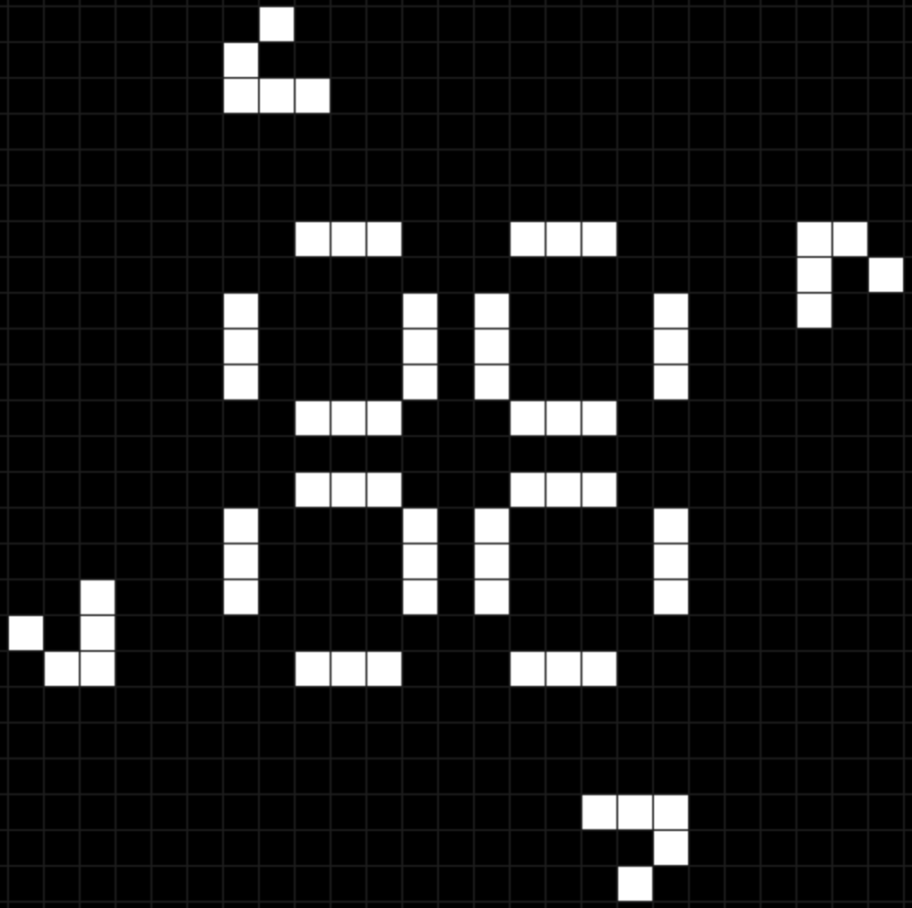

# 0001-game-of-life
In this project, we aim to turn John Conway's game of life into a music instrument. 

Thank you for attention :)

Polished version of this code will be available on my GitHub

please check the description, there will be links and everything.

Bye! :]

I used the OB-Xd synth - https://www.discodsp.com/obxd/

In the OB-Xd you can change presets in the menu. Select "Bank" (set of programs) and "program" which is a preset. You can also try to change the sounds with turning the knobs.

